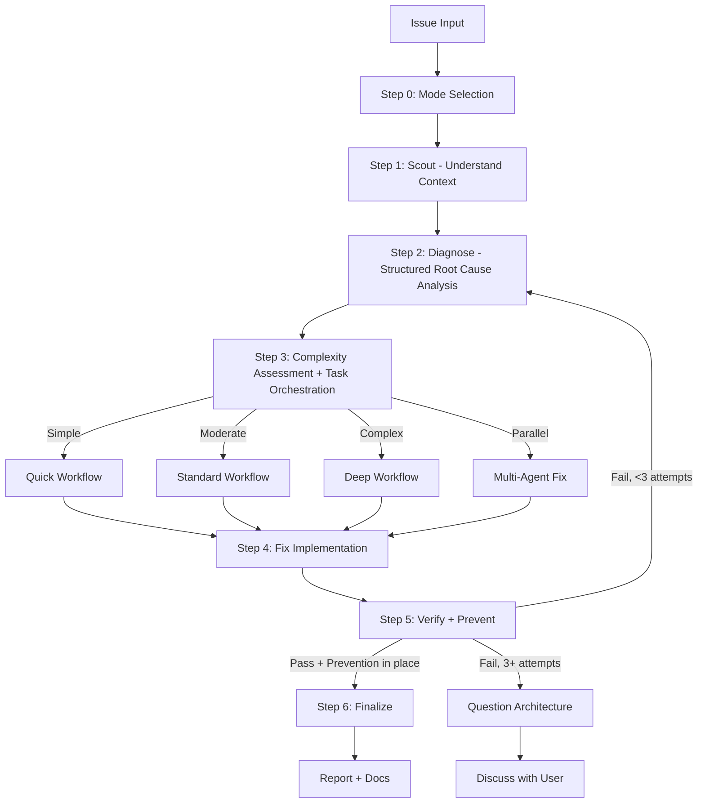

---

origin: theonekit-core
repository: The1Studio/theonekit-core
module: null
protected: true
---
# Fix Workflow Overview

## Process Flow



## Step 1: Scout (MANDATORY — never skip)

**Purpose:** Understand the affected codebase BEFORE forming any hypotheses.

1. Activate `/t1k:scout` skill OR launch 2-3 parallel `Explore` subagents
2. Discover: affected files, dependencies, related tests, recent changes (`git log`)
3. Read `./docs` for project context if unfamiliar

**Quick mode:** Minimal scout — locate affected file(s) and their direct dependencies only.
**Standard/Deep mode:** Full scout — map module boundaries, test coverage, call chains.

Output: `Step 1: Scouted - [N] files mapped, [M] dependencies, [K] tests found`

## Step 2: Diagnose (MANDATORY — never skip)

**Purpose:** Structured root cause analysis. NO guessing. Evidence-based only.

1. **Capture pre-fix state:** Record exact error messages, failing test output, stack traces, log snippets.
2. Activate `/t1k:debug` skill (systematic debugging + root-cause tracing techniques).
3. Activate `/t1k:think` skill — form hypotheses through structured reasoning, NOT guessing.
4. Spawn parallel `Explore` subagents to test each hypothesis against codebase evidence.
5. If 2+ hypotheses fail — auto-activate `/t1k:problem-solve` skill for alternative approaches.
6. Create diagnosis report: confirmed root cause, evidence chain, affected scope.

Full methodology: `references/diagnosis-protocol.md`

**Root cause categories:**
| Category | Examples |
|----------|---------|
| Syntax | Missing bracket, invalid import, typo |
| Logic | Wrong condition, off-by-one, null reference |
| Config | Missing env var, wrong path, version mismatch |
| Dependency | Missing package, incompatible version, circular dep |
| Environment | OS-specific, permission, network issue |

Output: `Step 2: Diagnosed - Root cause: [summary], Evidence: [brief], Scope: [N files]`

## Step 3: Task Orchestration (Moderate+ only)

After classifying, create native Claude Tasks for all phases upfront with dependencies.
See `references/task-orchestration.md`.

- Skip for Quick workflow (< 3 steps, overhead exceeds benefit)
- Use `TaskCreate` with `addBlockedBy` for dependency chains
- **Fallback:** If Task tools error, use `TodoWrite` for progress tracking.

## Step 4: Fix Implementation

- Route to registry `implementer` agent.
- Follow diagnosis findings — fix the ROOT CAUSE, not symptoms.
- Minimal changes only. Follow existing patterns.
- Simple: auto-approve if confidence >= 9.5
- Moderate/Complex: review gate before applying

**Cross-Module Impact Check** (if `installedModules` in `.claude/metadata.json`):
```bash
grep -r "{changed_symbol}" .claude/skills/ .claude/agents/ --include="*.md" -l
```
Output: `[CROSS-MODULE] {module} -> {file} references changed API "{symbol}"`

## Step 5: Verify + Prevent (MANDATORY — never skip)

1. **Verify (iron-law):** Run the EXACT commands from pre-fix state capture. Compare output.
2. **Regression test:** Add or update test(s) that specifically cover the fixed issue.
3. **Prevention gate:** Apply defense-in-depth validation. See `references/prevention-gate.md`.
4. **Parallel verification:** Launch `Bash` agents for typecheck + lint + build + test.

**If verification fails:** Loop back to Step 2. After 3 failures — question architecture, discuss with user.

Telemetry output:
```json
{"type": "logic", "component": "auth-service", "fixCategory": "moderate"}
```

Output: `Step 5: Verified + Prevented - [before/after comparison], [N] tests added, [M] guards added`

## Step 6: Finalize (MANDATORY — never skip)

1. Report summary: confidence score, root cause, changes, files, prevention measures
2. `docs-manager` subagent — update `./docs` if changes warrant (NON-OPTIONAL)
3. `TaskUpdate` — mark ALL Claude Tasks `completed`
4. Ask user if they want to commit via `git-manager` subagent
5. After fix: auto-run `/t1k:doctor` module checks if module files were modified

## Output Format

```
Step 0: [Mode] selected
Step 1: Scouted - [N] files, [M] deps
Step 2: Diagnosed - Root cause: [summary]
Step 3: [Complexity] detected - [workflow] selected
Step 4: Fixed - [N] files changed
Step 5: Verified + Prevented - [tests added], [guards added]
Step 6: Complete - [action taken]
```

## Anti-Rationalization Guards

| Trap | Reality |
|------|---------|
| "I can see the problem, let me fix it" | Seeing symptoms != understanding root cause. Scout first. |
| "Quick fix for now, investigate later" | "Later" never comes. Fix properly now. |
| "Just try changing X" | Random fixes waste time and create new bugs. Diagnose first. |
| "It's probably X" | "Probably" = guessing. Use structured diagnosis. Verify first. |
| "One more fix attempt" (after 2+) | 3+ failures = wrong approach. Question architecture. |
| "Emergency, no time for process" | Systematic diagnosis is FASTER than guess-and-check. |
| "I already know the codebase" | Knowledge decays. Scout to verify assumptions before acting. |
| "The fix is done, tests pass" | Without prevention, same bug class will recur. Add guards. |
| "It worked on my machine" | Reproduce in the reported environment. Your machine lies. |
