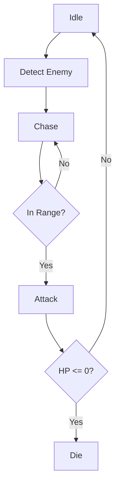
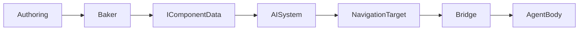

---

origin: theonekit-unity
repository: The1Studio/theonekit-unity
module: editor
protected: false
---
# Wiki Page Structure Reference

## Standard Demo Wiki Template

```markdown
# Demo-{Name}

> One-line summary: genre, perspective, unit count, key mechanic.

## Overview
- **Perspective**: top-down 2D / isometric / side-view / 3D
- **Unit Count**: N per team × 2 teams
- **Arena**: WxH units
- **Status**: Stable / In Progress / Experimental

## Unit Composition
| Type | Count | Role | Attack Range |
|------|-------|------|-------------|
| Melee | 25 | frontline tank | 2 |
| Ranger | 10 | ranged DPS | 15 |
| Mage | 5 | AoE burst | 12 |
| Boss | 1 | high HP | 8 |

## Combat Mechanics
- Attack type (melee/ranged/AoE)
- Damage formula references
- Cooldown or turn-based model
- Death/respawn rules

## AI Behavior
- BDP tree structure (detect → chase → attack → idle)
- Detection radius
- Crowd navigation tier (individual NavMesh vs Crowds flow field)

## Technical Architecture
- Key systems (list ISystem names)
- Package code vs demo-specific code
- Authoring components used

## Controls
(for player-controlled demos only)
- Movement: WASD
- Interact: E / Left Click
- Camera: scroll wheel zoom

## Diagrams

### Combat Flow


### Data Flow


## Known Issues
- [ ] Issue description — workaround if any

## Changelog
- 2026-03-21: Initial wiki page
```

## Diagram Requirements

Every wiki page MUST include at minimum:
1. **Combat Flow** — flowchart of AI state machine
2. **Data Flow** — how authoring reaches runtime systems

Optional but valuable:
- **Unit Stats Table** — BaseStats, DerivedCombatStats values
- **Arena Layout** — ASCII or Mermaid diagram of spawn positions
- **System Execution Order** — for complex demos with many interacting systems
